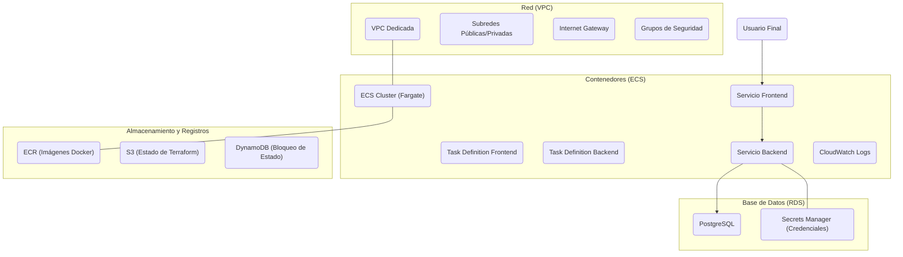
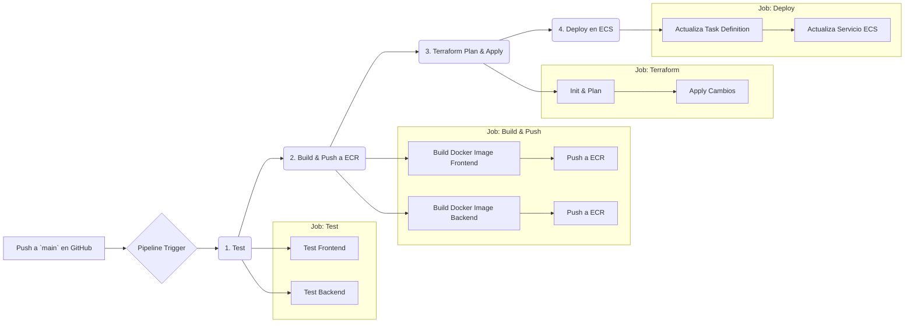

# Plantilla de Pipeline Completo para Aplicaciones en AWS

Este repositorio sirve como una plantilla para desplegar aplicaciones web modernas (frontend + backend) en AWS, utilizando una arquitectura robusta, escalable y automatizada con Terraform e CI/CD con GitHub Actions.

## 1. Objetivo del Proyecto

El objetivo es proporcionar una base de infraestructura como código (IaC) y un pipeline de CI/CD que permita a los desarrolladores:

- Levantar rápidamente una infraestructura completa en AWS.
- Automatizar el testeo, construcción y despliegue de aplicaciones.
- Servir como una plantilla fácilmente adaptable para nuevos proyectos, simplemente reemplazando el código del `frontend` y `backend`.

## 2. Arquitectura

### 2.1. Infraestructura en AWS

La infraestructura está definida con Terraform y se compone de los siguientes servicios principales:



- **VPC**: Una red aislada para todos nuestros recursos.
- **ECS (Fargate)**: Orquesta nuestros contenedores Docker sin necesidad de gestionar servidores.
- **RDS**: Una base de datos PostgreSQL gestionada.
- **ECR**: Un registro privado para nuestras imágenes Docker.
- **S3 & DynamoDB**: Para almacenar de forma segura y remota el estado de Terraform.

### 2.2. Flujo del Pipeline CI/CD

El pipeline se gestiona con GitHub Actions y sigue este flujo:



## 3. Estructura del Proyecto

```
complete-aws-app-pipeline/
├── .github/
│   └── workflows/
│       └── pipeline.yml      # Definición del pipeline de CI/CD
├── src/
│   ├── backend/              # Código fuente del backend (Node.js/Express)
│   │   └── Dockerfile
│   └── frontend/             # Código fuente del frontend (React)
│       └── Dockerfile
├── terraform/
│   ├── environments/
│   │   └── dev.tfvars        # Variables para el entorno de desarrollo
│   ├── modules/              # Módulos reutilizables de Terraform
│   │   ├── ecs/
│   │   ├── rds/
│   │   ├── s3/
│   │   └── vpc/
│   ├── main.tf               # Orquestación principal de módulos
│   ├── variables.tf          # Variables de entrada de Terraform
│   └── outputs.tf            # Salidas de Terraform
├── .gitignore
└── README.md
```

## 4. Tecnologías Utilizadas

- **Cloud**: AWS
- **IaC**: Terraform
- **CI/CD**: GitHub Actions
- **Contenedores**: Docker
- **Backend**: Node.js, Express, TypeScript
- **Frontend**: React, TypeScript
- **Base de Datos**: PostgreSQL

## 5. Guía de Configuración Inicial

### Prerrequisitos

- Cuenta de AWS
- AWS CLI configurado
- Terraform instalado
- Repositorio de GitHub

### Paso 1: Configurar Backend de Terraform

Terraform necesita un lugar para guardar su archivo de estado. Usaremos un bucket S3 para esto.

1. **Crear Bucket S3 para el estado:**

   ```bash
   aws s3api create-bucket \
       --bucket tu-nombre-de-bucket-tfstate \
       --region us-east-1 \
       --create-bucket-configuration LocationConstraint=us-east-1
   ```
2. **Crear Tabla DynamoDB para bloqueo de estado:**

   ```bash
   aws dynamodb create-table \
       --table-name terraform-state-lock \
       --attribute-definitions AttributeName=LockID,AttributeType=S \
       --key-schema AttributeName=LockID,KeyType=HASH \
       --provisioned-throughput ReadCapacityUnits=5,WriteCapacityUnits=5 \
       --tags Key=Project,Value=TerraformState
   ```
3. **Configurar `terraform/main.tf`:**
   Asegúrate de que el bloque `terraform` en `terraform/main.tf` apunte a tus recursos.

### Paso 2: Desplegar Infraestructura con Terraform

1. **Navegar al directorio de Terraform:**

   ```bash
   cd terraform
   ```
2. **Inicializar Terraform:**

   ```bash
   terraform init
   ```
3. **Revisar y Aplicar el Plan:**

   ```bash
   # Revisa los recursos que se crearán
   terraform plan -var-file="environments/dev.tfvars"

   # Aplica los cambios para crear la infraestructura
   terraform apply -var-file="environments/dev.tfvars" -auto-approve
   ```

### Paso 3: Configuración de GitHub

1. **Crear un usuario IAM para GitHub Actions:**
   Se necesita un usuario con permisos para interactuar con ECR, ECS, etc. La política `pipeline-policy.json` del historial de chat es una buena base.
2. **Generar Access Keys:**
   Crea un `Access Key ID` y un `Secret Access Key` para este usuario.
3. **Añadir Secretos al Repositorio de GitHub:**
   Ve a `Settings > Secrets and variables > Actions` en tu repositorio y añade los siguientes secretos:

   - `AWS_ACCESS_KEY_ID`: El ID de la clave de acceso.
   - `AWS_SECRET_ACCESS_KEY`: La clave de acceso secreta.

### Paso 4: Subir el Código

Con la infraestructura y los secretos listos, sube tu código al repositorio de GitHub.

```bash
git add .
git commit -m "Commit inicial de la aplicación"
git push origin main
```

Esto activará automáticamente el pipeline de GitHub Actions, que construirá y desplegará tus aplicaciones.

## 6. Cómo Adaptar para un Nuevo Proyecto

1. **Reemplazar el Código Fuente:**

   - Elimina el contenido de `src/frontend` y `src/backend`.
   - Coloca tu nueva aplicación de frontend y backend en sus respectivos directorios.
2. **Ajustar Dockerfiles:**

   - Modifica `src/frontend/Dockerfile` y `src/backend/Dockerfile` para que se ajusten a los requerimientos de construcción y ejecución de tus nuevas aplicaciones.
3. **Ajustar Variables de Terraform:**

   - Modifica `terraform/environments/dev.tfvars` para cambiar el nombre del proyecto, versiones o tamaños de instancia según sea necesario.
4. **Ajustar Pipeline (`.github/workflows/pipeline.yml`):**

   - Si tus aplicaciones tienen pasos de test o build diferentes, actualiza los comandos `npm test` o `npm run build` en el job `test`.

## 7. Comandos Útiles

### Terraform

- `terraform init`: Inicializa el directorio de trabajo.
- `terraform plan`: Crea un plan de ejecución.
- `terraform apply`: Aplica los cambios para alcanzar el estado deseado.
- `terraform destroy`: Destruye toda la infraestructura gestionada.
- `terraform output`: Muestra los valores de las salidas (ej. IP pública, endpoint de RDS).

### AWS CLI

- `aws ecs list-services --cluster <nombre-cluster>`: Lista los servicios ECS.
- `aws ecs describe-services --cluster <nombre-cluster> --services <nombre-servicio>`: Obtiene detalles de un servicio.
- `aws rds describe-db-instances --db-instance-identifier <id-instancia-db>`: Obtiene detalles de la base de datos.
- `aws ecr describe-repositories`: Lista los repositorios de imágenes Docker.

## 8. Limpieza

Para evitar costos, puedes destruir toda la infraestructura creada con un solo comando.

```bash
cd terraform
terraform destroy -var-file="environments/dev.tfvars" -auto-approve
```

No olvides eliminar también el bucket S3 y la tabla DynamoDB creados manualmente en el Paso 1.
